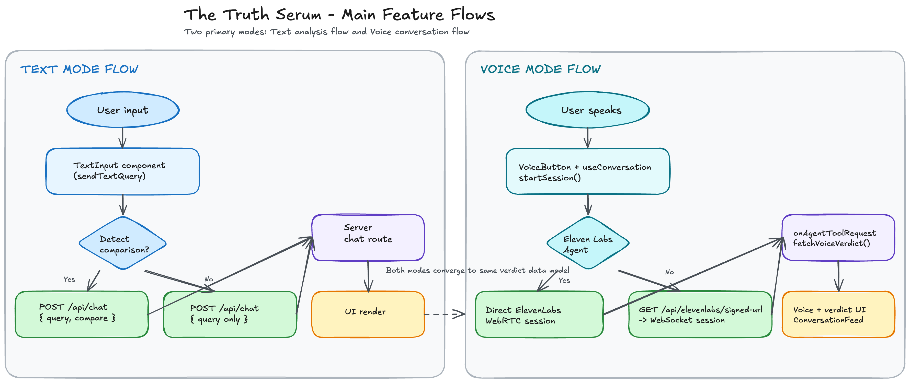
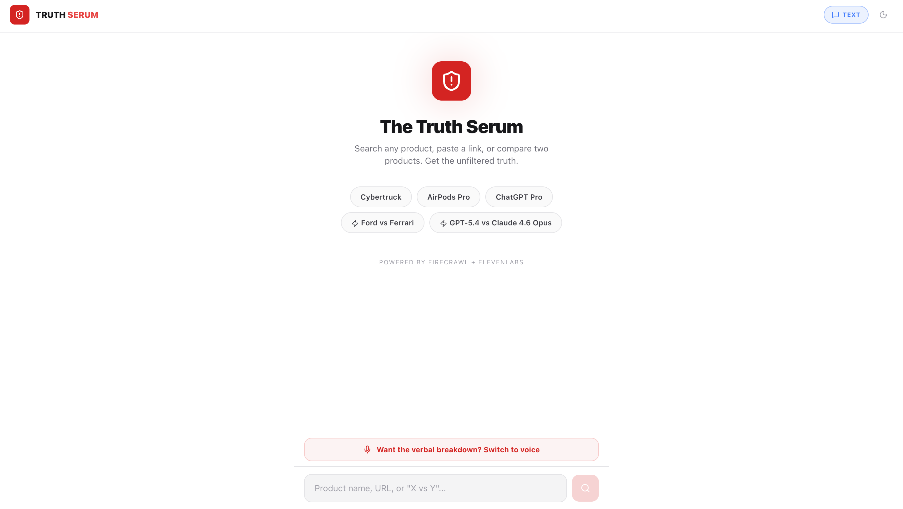
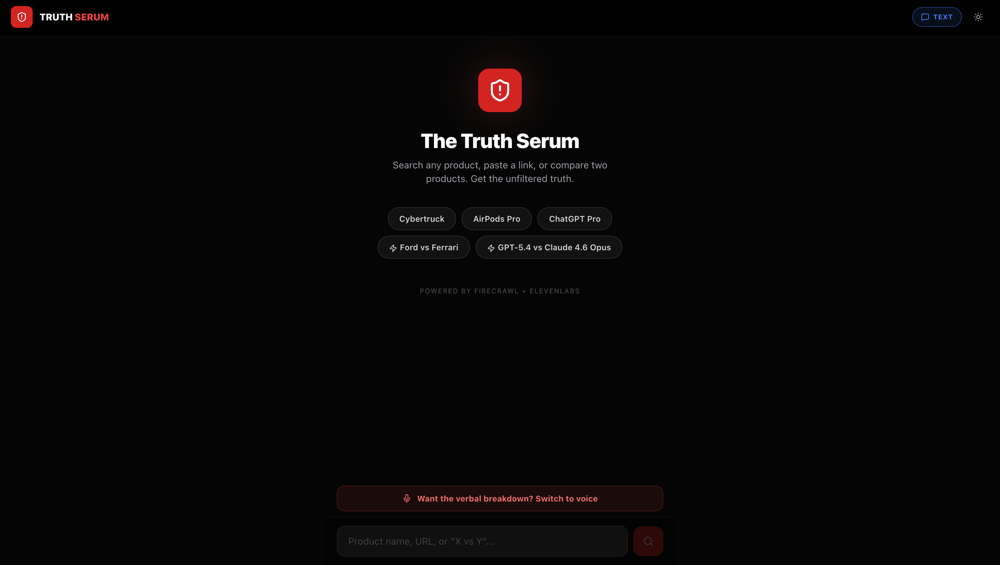
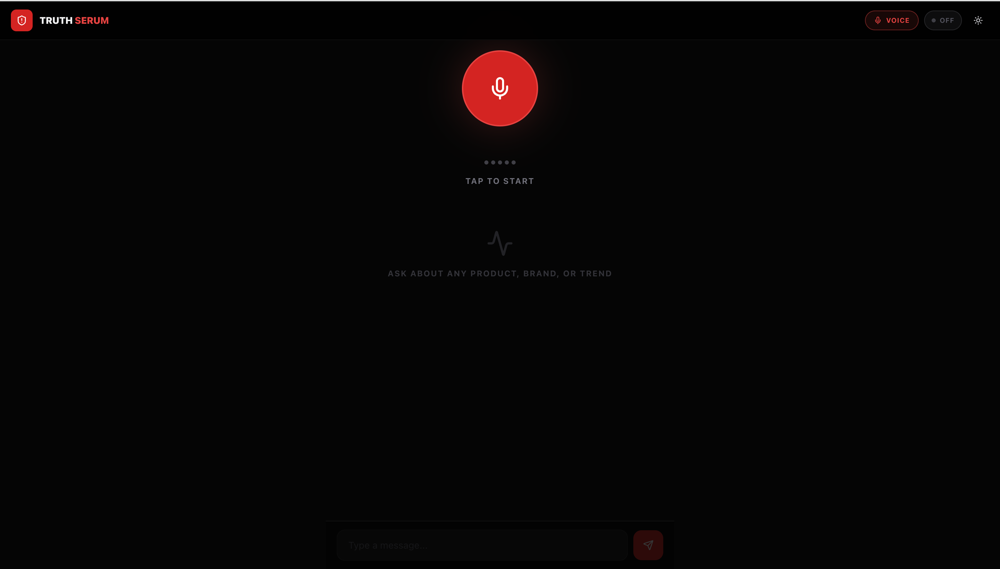
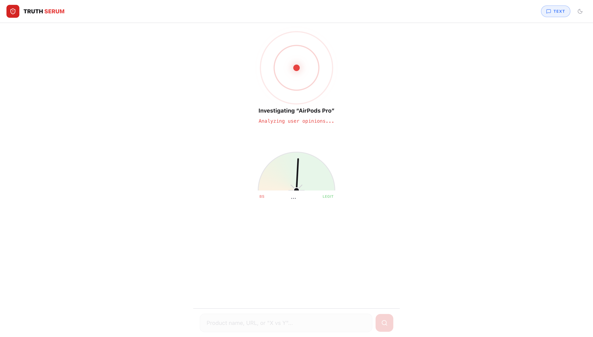
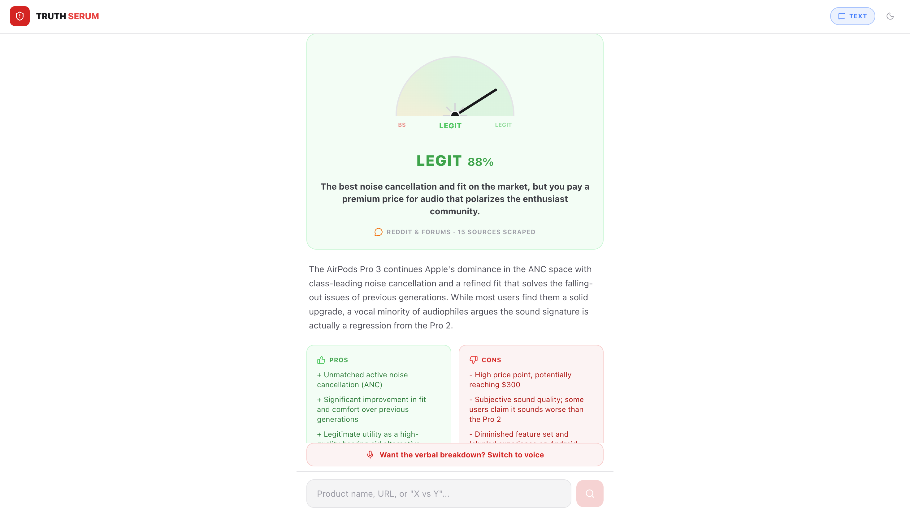
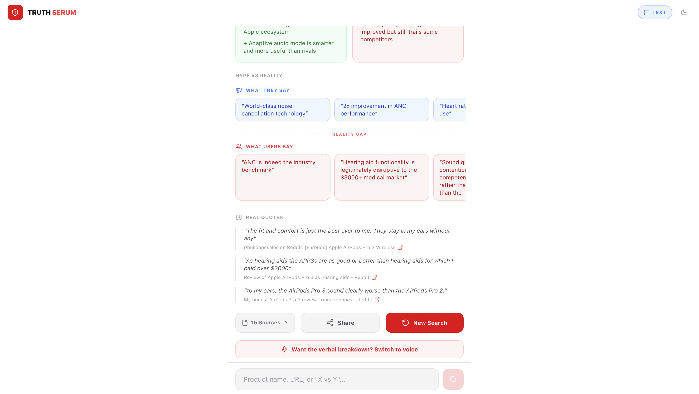
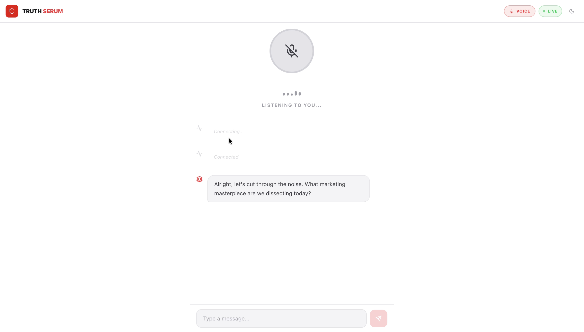

# The Truth Serum

> Marketing is what you say about yourself. Truth is what people say about you on Reddit at 3 AM.

The Truth Serum is a React + Node.js app that analyzes products using scraped web evidence.
It supports:

- voice conversations through ElevenLabs Conversational AI
- text queries in the UI
- URL analysis (paste a product page)
- side-by-side comparisons (`X vs Y`)

The backend uses Firecrawl to gather evidence and Gemini to produce a structured verdict.

---

## Demo Video

[](https://www.youtube.com/watch?v=WZhcX9UncGM)

[Watch Demo Video on YouTube](https://www.youtube.com/watch?v=WZhcX9UncGM)

### Architecture Diagram



---

## What the App Does

1. User enters a product query, URL, or comparison in the client.
2. Client calls `POST /api/chat`.
3. Server gathers evidence:
   - text/comparison mode: Firecrawl search (`searchTopic`)
   - URL mode: Firecrawl scrape + Firecrawl search (`scrapeAndSearch`)
4. Server sends evidence to Gemini (`analyzeVerdict` / `analyzeShowdown`).
5. Client renders:
   - truth score
   - verdict (`legit`, `mixed`, `sketchy`, `unknown`)
   - pros/cons
   - quotes and source links

Voice mode uses ElevenLabs session APIs and can trigger backend tools in parallel.

---

## Tech Stack

| Layer | Tech |
| --- | --- |
| Frontend | React 19, Vite 8, TypeScript, Tailwind CSS 4, `@elevenlabs/react` |
| Backend | Node.js, Express 5, TypeScript, Firecrawl SDK, Google Generative AI SDK |
| Tooling | `tsx`, ESLint, Concurrently |
| Infra | Docker Compose, Dockerfiles for client/server |

---

## Repository Structure

```text
the-truth-serum/
├── client/
│   ├── src/
│   │   ├── components/         # UI cards, inputs, voice controls, sources panel
│   │   ├── lib/                # shared types/utilities/theme hook
│   │   ├── App.tsx
│   │   ├── main.tsx
│   │   └── index.css
│   ├── .env.example
│   └── package.json
├── server/
│   ├── src/
│   │   ├── app.ts              # express app + route wiring
│   │   ├── config/             # env + Firecrawl client
│   │   ├── middleware/         # error handler
│   │   ├── routes/             # /api/health, /api/elevenlabs, /api/search, /api/chat
│   │   ├── services/           # ElevenLabs signed URL, Firecrawl search/scrape, Gemini analysis
│   │   └── utils/              # topic extraction helpers
│   ├── .env.example
│   ├── index.ts                # server entry point (listen)
│   └── package.json
├── infra/
│   ├── docker-compose.yml
│   ├── Dockerfile.client
│   └── Dockerfile.server
├── resources/                  # README screenshots
└── package.json                # root scripts for monorepo orchestration
```

---

## API Surface

### `GET /api/health`
Returns service status and whether Firecrawl/ElevenLabs keys are configured.

### `GET /api/elevenlabs/signed-url`
Returns a signed websocket URL for ElevenLabs Conversational AI when server-side ElevenLabs credentials are configured.

### `POST /api/search`
Runs Firecrawl search and returns raw evidence blocks for a topic.

### `POST /api/chat`
Primary analysis endpoint used by the client.

Request body:

```json
{
  "query": "string",
  "compare": "optional string"
}
```

Behavior:

- `query` is URL: scrape URL + web sentiment search, then Gemini verdict
- `compare` present: run showdown analysis for both terms
- otherwise: run single-product verdict analysis

---

## Setup

### Prerequisites

- Node.js `^20.19.0 || >=22.12.0` (required by Vite 8)
- npm
- API keys:
  - Firecrawl
  - Gemini
  - ElevenLabs (required for voice session features)

### Install

```bash
git clone https://github.com/abubakarsiddik31/the-truth-serum.git
cd the-truth-serum
npm install
npm run install-all
```

### Configure Environment

Create these files from examples:

```bash
cp server/.env.example server/.env
cp client/.env.example client/.env
```

`server/.env` values used by the app:

```env
FIRECRAWL_API_KEY=...
GEMINI_API_KEY=...
ELEVENLABS_API_KEY=...
ELEVENLABS_AGENT_ID=...
PORT=3001
```

`client/.env` values used by the app:

```env
VITE_API_BASE_URL=http://localhost:3001
VITE_ELEVENLABS_AGENT_ID=your_agent_id
```

Notes:

- If `VITE_ELEVENLABS_AGENT_ID` is set, the client starts voice sessions directly with that public agent ID.
- If `VITE_ELEVENLABS_AGENT_ID` is not set, the client falls back to `GET /api/elevenlabs/signed-url`.
- If `GEMINI_API_KEY` is missing, server returns fallback `unknown` analyses.

---

## Run

```bash
npm run dev
```

This starts both apps:

- client: Vite dev server on `http://localhost:5173`
- server: Express API on `http://localhost:3001`

Other scripts:

| Command | Description |
| --- | --- |
| `npm run client` | run client dev server only |
| `npm run server` | run server dev process only |
| `npm run build` | build client + compile server TypeScript |
| `npm run start` | run server via `tsx index.ts` |

---

## Docker

Docker assets are present under `infra/` (`docker-compose.yml`, `Dockerfile.client`, `Dockerfile.server`).

The default local development path for this repository is `npm run dev`.

---

## Current Behavior Notes

- UI starts in **text mode**.
- Theme defaults to **dark** on first load.
- `POST /api/search` and `POST /api/chat` both exist; the client primarily uses `/api/chat`.
- `server/test.ts` exists as a manual script but is not wired to an npm `test` command.

---

## Screenshots









---

## License

ISC
